# **Human Action Recognition in Videos using Pedestrian Keypoints**

*Case study in Artificial Intelligence and Visual Computing as part of a [group school project](https://moodle.polytechnique.fr/course/view.php?id=13078) with [IDEMIA](https://www.idemia.com/)*.

___
___

- [**Introduction**](#introduction)
- [**The Dataset**](#the-dataset)
    - [*Presentation of the Dataset*](#presentation-of-the-dataset)
    - [*Structure of a Skeleton*](#structure-of-a-skeleton)
    - [*The 60 Action Classes*](#action-classes)
    - [*Content of the Files*](#content-of-the-files)
- [**Analysis and Visualization of the Dataset**](#analysis-and-visualization-of-the-dataset)
- [**Models**](#models)
- [**Resuts**](#results)
- [**OpenPose**]()
- [**Conclusion**](#conclusion)
- [**References**](#references)

___

## **Introduction**

Classifying pedestrians' every-day life actions is an interesting topic in computer vision, including a lot of sub-topics like pedestrian detection and segmentation, video consolidation, classification, etc.

To recognize an action, a human being would localize the person first, analyze the position of its body-parts, see how these are moving and interacting, and classify accordingly.

We propose here to reproduce this process, using the information of body-parts position (pedestrian keypoints/skeleton).
The data to process is a sequence of labelled 3D coordinates on pedestrians, and the output is the label of the current action (walking, running, biking, falling on the ground, fighting, etc.).

___

## **The Dataset**

### ***Presentation of the dataset***

When cloning the current respository please also download the following [zip file](https://drive.google.com/file/d/1U1veKcEC2B5Xn_o3StN3U8qNFHRhxqLu/view?usp=sharing) (5.8 Go zipped and 13,4 Go unzipped), and extract it in the folder named *data* at the root of the repository. This compressed folder contains the relevant data for our project. Once it is done, run [`data_cleaning.py`](./data_cleaning.py) to format the data correctly.

The dataset used is the ***NTU RGB+D - Action Recognition Dataset*** (***Skeletons***) described in [this repository](https://github.com/shahroudy/NTURGB-D).
It contains 56,880 skeletal data samples (3D locations of 25 major body joints at each frame).

302 samples have missing or incomplete skeleton data. The list of these are provided [here](./data/missing_skeletons.txt).

Three cameras (with a recording frequence of 30 frames per second) were used at the same time to capture three different horizontal views from the same action. For each setup, the three cameras were located at the same height but from three different horizontal angles: $−45\degree, 0\degree, +45\degree$.

Here are the height and distance (in meters) of the three cameras for each collection setup:

|                       |           |           |                       |           |           |
|-----------------------|-----------|-----------|-----------------------|-----------|-----------|
| **Setup Number**      | Height    | Distance  | **Setup Number**      | Height    | Distance  |
|                       |           |           |                       |           |           |
| **1**                 | 1.7       | 3.5       | **10**                | 1.8       | 3.0       |
| **2**                 | 1.7       | 2.5       | **11**                | 1.9       | 3.0       |
| **3**                 | 1.4       | 2.5       | **12**                | 2.0       | 3.0       |
| **4**                 | 1.2       | 3.0       | **13**                | 2.1       | 3.0       |
| **5**                 | 1.2       | 3.0       | **14**                | 2.2       | 3.0       |
| **6**                 | 0.8       | 3.5       | **15**                | 2.3       | 3.5       |
| **7**                 | 0.5       | 4.5       | **16**                | 2.7       | 3.5       |
| **8**                 | 1.4       | 3.5       | **17**                | 2.5       | 3.0       |
| **9**                 | 0.8       | 2.0       |                       |           |           |
|                       |           |           |                       |           |           |

Each file in the dataset is in the format of SsssCcccPpppRrrrAaaa (e.g., S001C002P003R002A013), in which:
- ***sss*** is the setup number (between 001 and 017)
- ***ccc*** is the camera ID (between 001 and 003):
- ***ppp*** is the performer ID (between 001 and 040)
- ***rrr*** is the replication number (001 or 002 because each subject perform a task twice)
- ***aaa*** is the action class label (between 001 and 060)

### **Structure of a skeleton**

Here are the 25 joints considered in the representation of a skeleton:

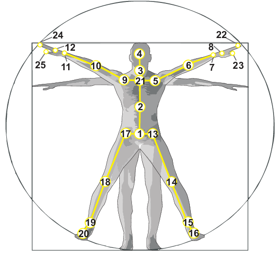

|                           |                           |                           |                           |                           |
|---------------------------|---------------------------|---------------------------|---------------------------|---------------------------|
| 1. (*Base*) Spine         | 6. (*Left*) Elbow         | 11. (*Right*) Wrist       | 16. (*Left*) Foot         | 21. Spine                 |
| 2. (*Mid*) Spine          | 7. (*Left*) Wrist         | 12. (*Right*) Hand        | 17. (*Right*) Hip         | 22. (*Left*) Hand Tip     |
| 3. Neck                   | 8. (*Left*) Hand          | 13. (*Left*) Hip          | 18. (*Right*) Knee        | 23. (*Left*) Thumb        |
| 4. Head                   | 9. (*Right*) Shoulder     | 14. (*Left*) Knee         | 19. (*Right*) Ankle       | 24. (*Right*) Hand Tip    |
| 5. (*Left*) Shoulder      | 10. (*Right*) Elbow       | 15. (*Left*) Ankle        | 20. (*Right*) Foot        | 25. (*Right*) Thumb       |
|                           |                           |                           |                           |                           |

### **The 60 Action Classes**

The dataset contains 60 action classes listed below:

|                                                  |                                       |                                           |
|--------------------------------------------------|---------------------------------------|-------------------------------------------|
| A1. drink water                                  | A2. eat meal/snack                    | A3. brushing teeth                        |
| A4. brushing hair                                | A5. drop                              | A6. pickup                                |
| A7. throw                                        | A8. sitting down                      | A9. standing up (from sitting position)   |
| A10. clapping                                    | A11. reading                          | A12. writing                              |
| A13. tear up paper                               | A14. wear jacket                      | A15. take off jacket                      |
| A16. wear a shoe                                 | A17. take off a shoe                  | A18. wear on glasses                      |
| A19. take off glasses                            | A20. put on a hat/cap                 | A21. take off a hat/cap                   |
| A22. cheer up                                    | A23. hand waving                      | A24. kicking something                    |
| A25. reach into pocket                           | A26. hopping (one foot jumping)       | A27. jump up                              |
| A28. make a phone call/answer phone              | A29. playing with phone/tablet        | A30. typing on a keyboard                 |
| A31. pointing to something with finger           | A32. taking a selfie                  | A33. check time (from watch)              |
| A34. rub two hands together                      | A35. nod head/bow                     | A36. shake head                           |
| A37. wipe face                                   | A38. salute                           | A39. put the palms together               |
| A40. cross hands in front (say stop)             | A41. sneeze/cough                     | A42. staggering                           |
| A43. falling                                     | A44. touch head (headache)            | A45. touch chest (stomachache/heart pain) |
| A46. touch back (backache)                       | A47. touch neck (neckache)            | A48. nausea or vomiting condition         |
| A49. use a fan (with hand or paper)/feeling warm | A50. punching/slapping other person   | A51. kicking other person                 |
| A52. pushing other person                        | A53. pat on back of other person      | A54. point finger at the other person     |
| A55. hugging other person                        | A56. giving something to other person | A57. touch other person's pocket          |
| A58. handshaking                                 | A59. walking towards each other       | A60. walking apart from each other        |
|                                                  |                                       |                                           |

### **Content of the files**

The content of a given file in the *NTU RGB+D skeletons dataset* is described here.

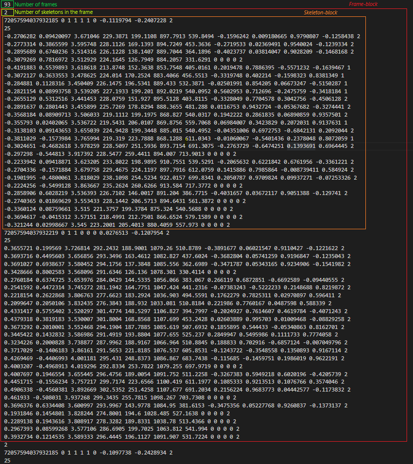

* The first line contains the total number of frames, and is followed by a succession of *frame-blocks* (data lines for each of the frames).

* Then, for each of these frame-blocks, the first line is the number of skeletons present in current frame, and is followed by *skeleton-blocks* (data lines for each of the skeletons in the frame). Generally, there is only one skeleton per frame.

* Finally, each of the skeleton-blocks is structured as it follows:

    * In the first line we have:

        * (int) The body ID
        * (bool) clipedEdges
        * (bool) handLeftConfidence
        * (bool) handLeftState
        * (bool) handRightConfidence
        * (bool) handRightState
        * (bool) isResticted
        * (float) leanX
        * (float) leanY
        * (int) trackingState
    
    * In the second line, the only value present gives the number of joints (always equals to 25) 

    * Each of the following lines correspond to a joint of the the skeleton (described in this [part](#skeleton-joints)), and has the following values in the same order:

        * Coordinates of the joints in the space (with the camera being the center of the space *i.e.* origin = $(0,0,0)$) in meters:
        
            * (float) cameraX
            * (float) cameraY
            * (float) cameraZ
        
        * Coordinates of the joints on the depth image (we don't have it but it has a resolution of $512 \times 424$) in pixels:
        
            * (float) depthX  
            * (float) depthY
        
        * Coordinates on the color image (we don't have it but it has a resolution of $1920 \times 1080$) in pixels:
            
            * (float) colorX $\in[0,1919]$
            * (float) colorY $\in[0,1079]$

        * Orientation coordinates of the joint orientation:
            
            * (float) orientationW
            * (float) orientationX
            * (float) orientationY
            * (float) orientationZ

        * State of the joint:

            * (int) trackingState
    

___

## **Analysis and Visualization of the Dataset**

For the purpose of this project we will only consider the following actions:

* Class 0 : Pickup (A6)
* Class 1 : Throw (A7)
* Class 2 : Sitting-down (A8)
* Class 3 : Standing-up (*from sitting position*) (A9)
* Class 4 : Take-off jacket (A15)
* Class 5 : Reach into pocket (A25)
* Class 6 : Pointing to something with finger (A31)
* Class 7 : Check time (*from watch*) (A33)
* Class 8 : Falling (A43)

Moreover, if a sequence contains more than one skeleton, we will only consider the first one (the one of the person doing the action).

The analysis of the resulting datasets (*obtained after running* [`data_cleaning.py`](./data_cleaning.py)) is done [here](./data_analysis.ipynb).
The visualization of the resulting datasets is done [here](./dta_visualization.ipynb).

### **Number of frames**

The following dataframe summarises the distribution of the number of frames according to the action classe considered.

|                   |                   |                               |                               |                               |                                   |                               |
|-------------------|-------------------|-------------------------------|-------------------------------|-------------------------------|-----------------------------------|-------------------------------|
| **Action Class**  | **Nb of Samples** | **Nb of Frames** (***Mean***) | **Nb of Frames** (***Std***)  | **Nb of Frames** (***Min***)  | **Nb of Frames** (***Median***)   | **Nb of Frames** (***Max***)  |
|                   |                   |                               |                               |                               |                                   |                               |
| 0                 | 943               | 81                            | 14                            | 54                            | 81                                | 131                           |
| 1                 | 944               | 64                            | 13                            | 37                            | 62                                | 136                           |
| 2                 | 941               | 74                            | 14                            | 46                            | 74                                | 119                           |
| 3                 | 936               | 64                            | 12                            | 39                            | 63                                | 120                           |
| 4                 | 945               | 141                           | 34                            | 66                            | 138                               | 277                           |
| 5                 | 946               | 97                            | 23                            | 54                            | 94                                | 202                           |
| 6                 | 944               | 56                            | 12                            | 32                            | 54                                | 110                           |
| 7                 | 946               | 64                            | 14                            | 36                            | 62                                | 128                           |
| 8                 | 946               | 64                            | 12                            | 40                            | 62                                | 139                           |
|                   |                   |                               |                               |                               |                                   |                               |

Here are a few remarks from those different values:

* Each action class has an equivalent number of sample (1% of difference between the smaller and the bigger class).
* The mean and the median number of frames are almost equal, for each of the action class.
* Some actions have a very different average frame count (in some cases doubling). Nevertheless this is normal since some actions require more or less movements, and therefore do not have the same duration.

### **Occupation of space**

In this part we will see, for each action class, how the space is used (3D dataset) and where on the screen the action are most likely to be located (2D dataset).

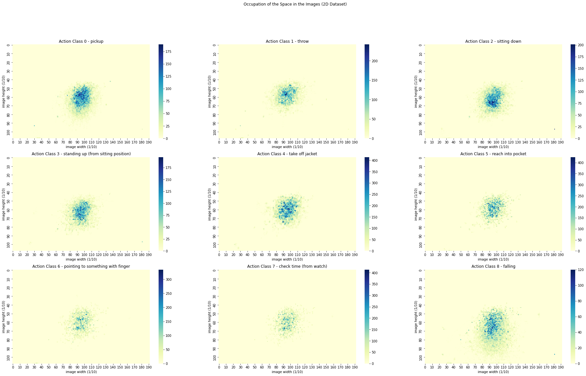

We can see from this heatmap that the actions take place in the centre of the images.

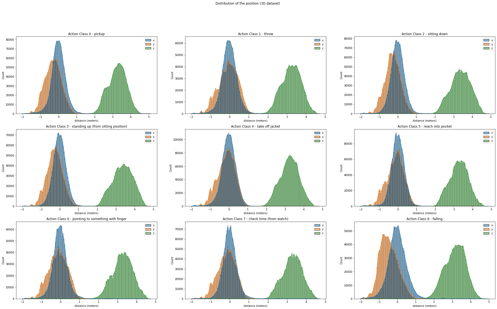

From this histogram we can see that the position distribution is somewhat alike among the different action class. However, once again, the actions are centered around 0 for the X and Y coordinates, and located around  a certain depth band for the Z coordinate.

### **Visualization of an action**

Animation of a skeleton for the Action Class 7 (throw):

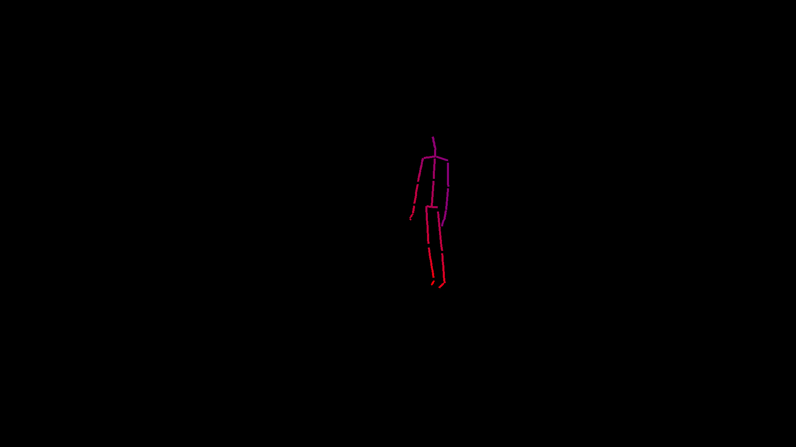

Animation of a skeleton for the Action Class 8 (sitting down):

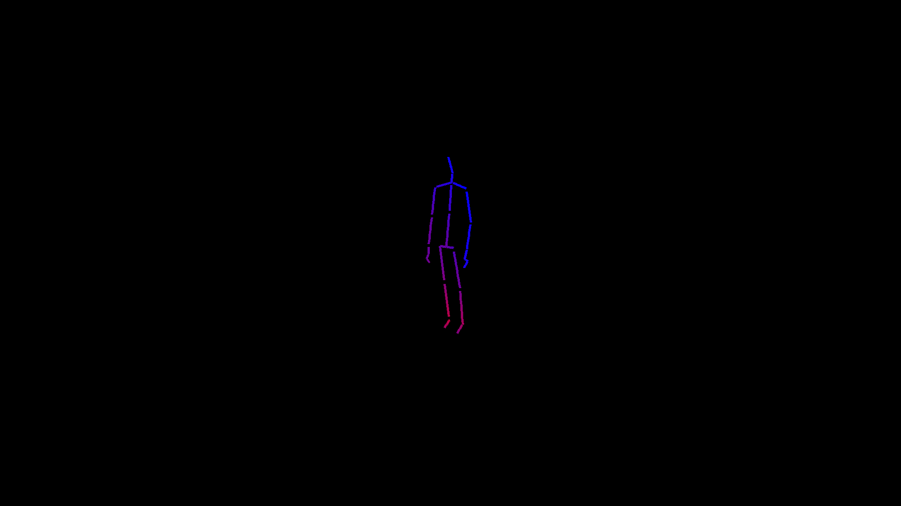

Animation of a skeleton for the Action Class 9 (standing up):

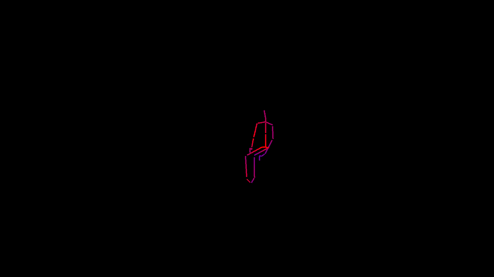

Animation of a skeleton for the Action Class 33 (check time):

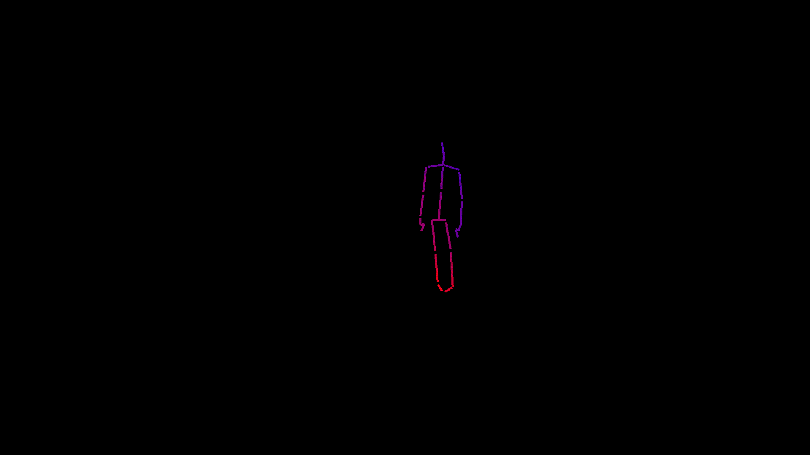

___

## **Models**

To perform the task aforementioned we decided to implement LSTM (*Long Short Term Memory*) networks ([here](./model.ipynb)). Indeed, given the sequential aspect of our data it seems relevant to consider models that would take into account such specificity.

Here are the loss and accuracies of the three models considered:

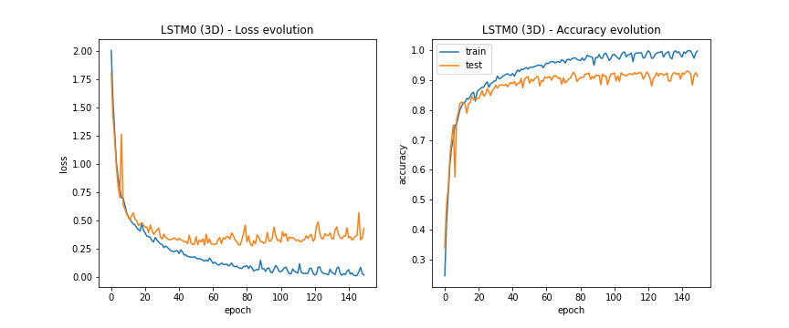
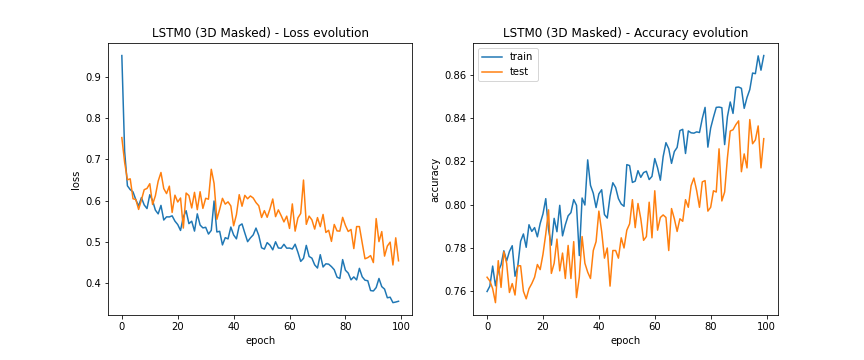
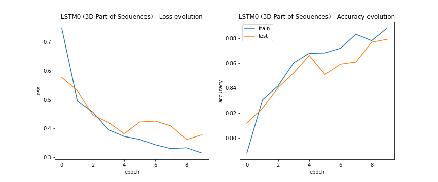

Now let's see how the models perform depending on the percentage of the sequence given as input:

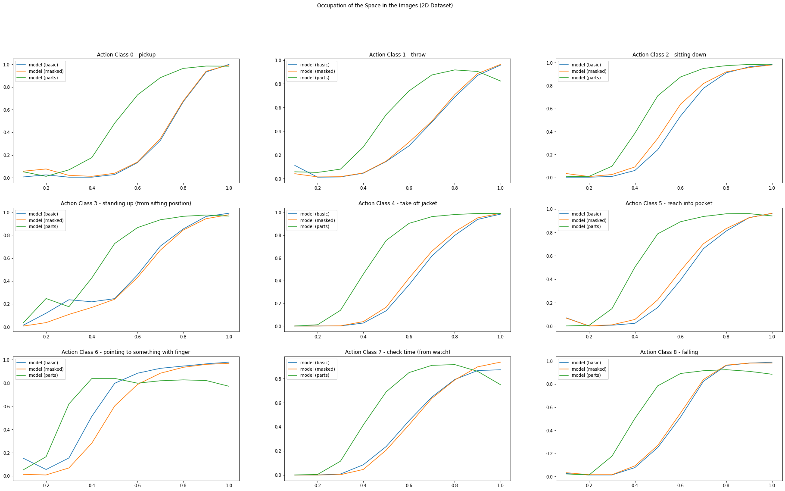
___

## **Results**

___

## **Conclusion**

___

### **References**

- [**NTU RGB+D - Action Recognition Dataset**](https://github.com/shahroudy/NTURGB-D)